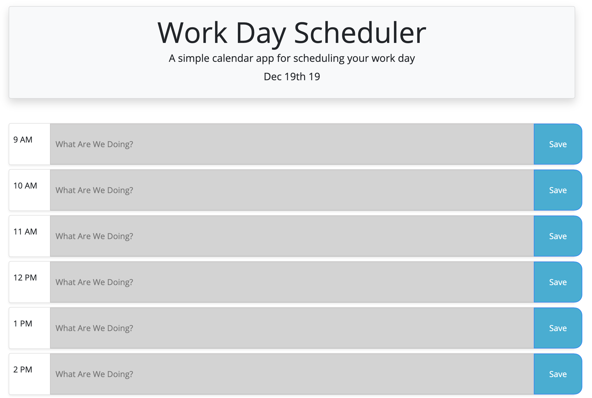

# day-planner


## Summary 

This application is a simple calander that allows the user to save events for each hour of the day. This run's in the browser and feature's dynamically updated HTML and CSS powered by jQuery. In addition the app display's standard business hours (9 a.m. to 5 p.m.) along the left hand side of each input row. Depending on the time of day, the schedule input feilds update their color indicating to the user wether items are in the past, present or future.


## Site Picture 

  
 

## Technologies Used
- jQuery - Used for event listeners of parent and childeren elements as well as to store and recall those varible in local storage.
- momentjs - Used to pull current date and local time.
- javascript - Used to dynamically change html and store user-input.
- Bootstrap - Used to pull existing html and CSS for creating     resposive organizational structer and styling for the site.
- HTML - Used to create elements on the DOM
- CSS - Styles html elements on page
- Git - Version control system to track changes to source code
- GitHub - Hosts repository that can be deployed to GitHub Pages
 


## Code Snippet

levraging jQuery for this calander simplified both the events that store user input to local storage as well as retrieveing them to be displayed on the page when the user refreshes the browser. By using specific id's correlating with the time of day we can retreive the varible stored in realtion to the onlcick that stored it.

```js

$(".rowBtn").on("click", function() {
    var timeOfday = $(this).parent().attr("id");
    var textContent = $("input").val().trim();

    localStorage.setItem(timeOfday, textContent);
    console.log(timeOfday, textContent);
});

```


## Built With

* [jQuery](https://api.jquery.com/)
* [HTML](https://developer.mozilla.org/en-US/docs/Web/HTML)
* [CSS](https://developer.mozilla.org/en-US/docs/Web/CSS)
* [Boostrap](https://getbootstrap.com/)

## Authors

**Asli Farah**
- [Link to Github](https://github.com/aslifarah/dayplanner)


